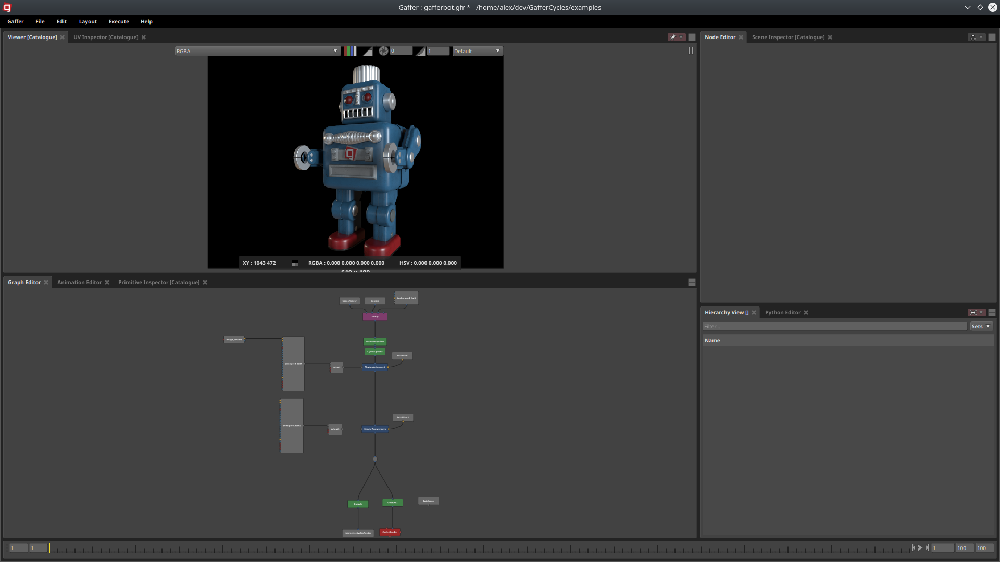

# GafferCycles

 

Cycles for Gaffer. Cycles is a submodule to this project, and will grab the dependencies from
the Gaffer install directory. Most all of Cycles' dependencies are covered by Gaffer, except
for the optional dependencies OpenSubdiv and Embree.

### Build Instructions

**Requires:**

* cmake
* Gaffer Install from GafferHQ
* (optional)OpenSubdiv
* (optional)Embree
* (optional)OptiX
* (optional)Gflags+Glog

Check Optional dependency install down below for easy python scripts

**In a terminal (Linux/Ubuntu):**
```
export GAFFER_ROOT=<gaffer install path>
export GAFFERCYCLES=<install destination>
export LD_LIBRARY_PATH=$GAFFER_ROOT/lib

git clone --recurse-submodules https://github.com/boberfly/GafferCycles.git
cd GafferCycles
mkdir build
cd build
cmake -DCMAKE_CXX_COMPILER=g++-6 -DGAFFER_ROOT=$GAFFER_ROOT -DCMAKE_INSTALL_PREFIX=$GAFFERCYCLES ..
make install -j <num cores>
```

**Optional dependencies+install:**

Run this after cloning the git repo and before building
```
cd dependencies
python ./build/build.py --project Gflags --buildDir $GAFFERCYCLES --forceCCompiler gcc-6 --forceCxxCompiler g++-6
python ./build/build.py --project Glog --buildDir $GAFFERCYCLES --forceCCompiler gcc-6 --forceCxxCompiler g++-6
python ./build/build.py --project Embree --buildDir $GAFFERCYCLES --forceCCompiler gcc-6 --forceCxxCompiler g++-6
python ./build/build.py --project OpenSubdiv --buildDir $GAFFERCYCLES --forceCCompiler gcc-6 --forceCxxCompiler g++-6
cd ../build
cmake -DCMAKE_CXX_COMPILER=g++-6 -DGAFFER_ROOT=$GAFFER_ROOT -DCMAKE_INSTALL_PREFIX=$GAFFERCYCLES -DWITH_CYCLES_EMBREE=ON -DWITH_CYCLES_OPENSUBDIV=ON -DWITH_CYCLES_LOGGING=ON ..
make install -j <num cores>
```
For OptiX, it will need to be installed from Nvidia's website and ```-DWITH_CYCLES_DEVICE_OPTIX=ON -DOPTIX_ROOT_DIR=$OPTIX_ROOT``` added to the cmake line.

### Runtime Instructions

Add to Gaffer extensions path:

`export GAFFER_EXTENSION_PATHS=$GAFFERCYCLES:$GAFFER_EXTENSION_PATHS`

Run Gaffer:

`gaffer`

GafferCycles should be stable enough to try out now, I have made builds for Linux under releases.

Make sure to append where GafferCycles is installed/extracted to by appending to $GAFFER_EXTENSION_PATHS so that Gaffer will detect GafferCycles.

### Docker Instructions

To build GafferCycles against the VFX Platform and be 100% consistent with upstream GafferHQ, run:
```
./build_docker.sh
```
If you have docker correctly installed, this should make a CentOS 7-based image, build GafferCycles and place the resulting package into the out/ directory (can be another path using the --output flag) eg.
```
./build_docker.sh --output /path/to/output
```
Alternatively, you can build with Nvidia OptiX support. You must download OptiX and copy it to this directory which needs to be named:
```
NVIDIA-OptiX-SDK-7.0.0-linux64.sh
```
And run:
```
./build_docker_optix.sh
```

Docker Cheatsheet
-----------------

From https://github.com/GafferHQ/build :

Remove stopped containers :

`docker ps -aq --no-trunc | xargs docker rm`

Remove old images :

`docker images -q --filter dangling=true | xargs docker rmi`
